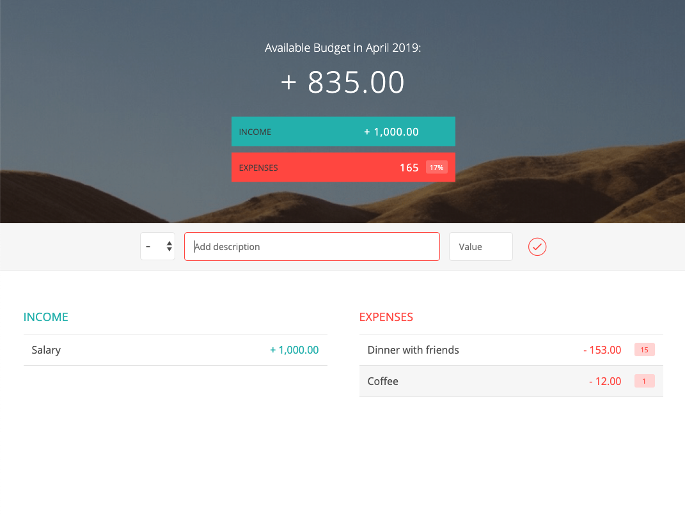

# Badgety


Badgety is a practical and versatile budget tracking and money management app, offering users an easy-to-read visualization of their finances and a detailed log of their spending habits. With Spent, users can create budgets, set spending goals, and store information about recent purchases on incomes. 

## Technologies

- HTML5
- CSS3
- Java Script (ES6)

## Screenshot



## Directions to use

Step 1. Download or clone project to your local computer. 
```
https://github.com/kplakosh/badgety
```
Step 2. Open index.js and enjoy using the Budgety.
